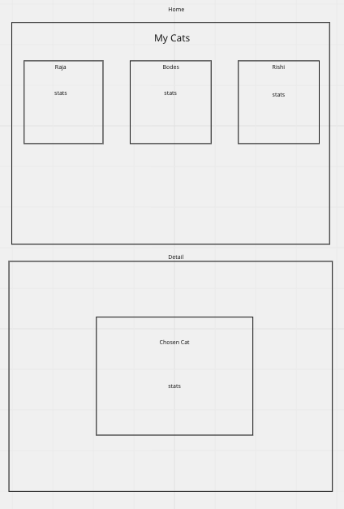

# Plan

## Home page

### -div for list of cats

### -render each item once its fetched

## Detail page

### -section and div for stats

### -link back to home page

## Events

### on home page load

#### -fetch items from supabase

#### -Display all items -loop through, render, append to container

### on detail page load

#### -fetch single item from supabase

#### -render to page based on items info

#### -URLSSearchParams to get item by id

## Functions

#### -fetch-utils : getItem, getItemById

#### -render-utils : renderItemCard, renderItemDetail

## Slices

### 1. get all items to render to home page

### 2.make item cards clickable to redirect to det. page

### 3.get detail page to render with appropriate deets

### 4. us URLSearchParams to fill in id 'dynamically'
